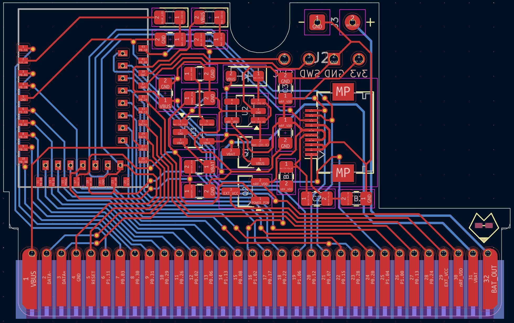
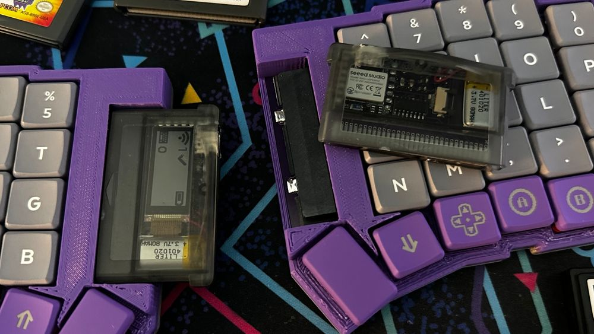
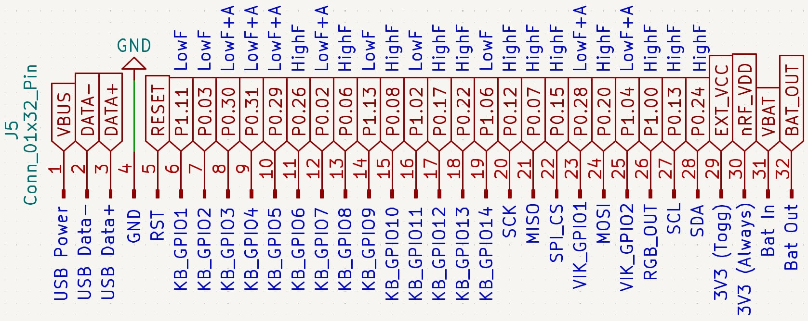
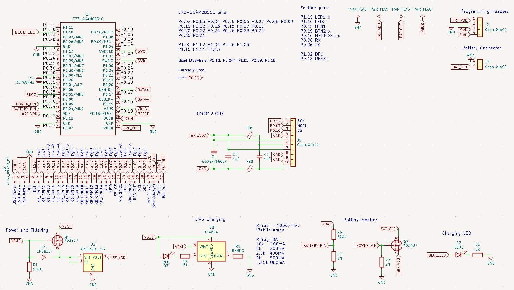

# TypePak Advance

The [TypePak Advance](https://github.com/ImStuBTW/typeboy-advance) is an update to my original [TypePak](https://github.com/ImStuBTW/typeboy_and_typepak/tree/main/typepak) design from 2023. The original idea for the concept was to put as many wireless keyboard components as possible inside of the shell of a Game Boy Advance cartridge. This allows you to more easily move the microcontroller between builds, but honestly it's primarily done for aesthetic reasons. Slapping a Game Boy cartridge port and cartridge onto the side of one's keyboard takes up a decent amount of space compared to a Pro Micro or a XIAO, but it does look neat. If you're iterating through designs rapidly, it also cuts down on the amount of considerations you need to make for things like battery JST headers.

The original TypePak design had a few flaws. It embedded an entire XIAO nRF52840 microcontroller onto the Game Boy cartridge breakout board. This simplified things on the design side, but complicated the build substantially. The XIAO's USB port needed to be exposed to flash new firmware and charge the TypePak's battery, so a large chunk needed to be cut out with a Dremel. The USB port was also fairly tall, and it had a nasty habit of crushing the integrated Sharp Memory Display as one tried to slide the enclosure together. In total 3 original TypePaks have been built, and only one managed to get a working display. Finally the pinout situation is less than ideal. The XIAO is famously limited on the amount of GPIO ports it has on offer, so the original TypePak leveraged a shift register to provide a few additional column pins. This worked well enough for split keyboards, but it's still not enough for unibody designs. In hindsight I *really* should have broken out the shift register's daisy-chain pin.

So this v2 attempt is seeking to clean up a few lingering issues with the TypePak. The TypePak Advance's largest changes are:
- Leveraging a bare nRF52840 module to save space and give the display more space.
- Dropping the integrated USB port entirely in favor of breaking out those pins over the edge connector.
- More pins! The TypePak Advance has 23 GPIO pins exposed in total.
    - The nRF52840's high frequency pins are grouped together with the [VIK](https://github.com/sadekbaroudi/vik) keyboard extension standard in mind. After the VIK's SPI, I2C, RGB, and 2 GPI pins, the TypePak Advance still has 14 additional pins to work with.
- Features an always-on 3v3 pin and a software controlled 3v3 pin to allow persistent and power conscious peripherals. 

To build a TypePak Advance compatible keyboard, one would need to include a Game Boy cartridge slot, a USB port for charging and data, a power switch, and a reset button.

The TypePak Advance leveraged the [nRFMicro](https://github.com/joric/nrfmicro) project for the basis of its schematic, and owes a great deal to the team's excellent documentation. Thanks y'all! The Game Boy Cartridge PCB designs are from [KiCAD-GamePaks](https://github.com/djedditt/kicad-gamepaks)

## Pinout

The TypePak Advance offers an indulgent 32 pins on its edge connector. A minimalist XAIO this is not. Nine of these pins are reserved for power, data, and board management features, but that still leaves you with 23 pins of GPIO. From left to right, you've got:

- The USB power and data pins. These pins need to be routed to a USB socket on the main keyboard PCB. (Most likely a USB-C port, but the pins can be put into a socket shape of your choice.)
- The Reset pin. Bridge this with the GND pin and your microcontroller will restart. Bridge it twice and the nRF52840 will boot into its flashing mode. This Reset pin and the GND should be wired up to a pushbutton on the main keyboard PCB.
- 14 GPIO pins. These pins are a mixture of the nRF52840's "Low Frequency" and "High Frequency" pins. The [nRFMicro Wiki](https://github.com/joric/nrfmicro/wiki/Pinout#low-drive-pins) has a good rundown, but essentially the high frequency pins are recommended for serial communication. Six of these pins can also be used for analog inputs.
- 9 additional serial and GPIO pins laid out in a similar order as to the [VIK](https://github.com/sadekbaroudi/vik) keyboard extension standard.
    - SPI's clock, input, output, and a chip select pin. The SCK and MISO pins have already been used by the built in Sharp Memory Display. These pins can be re-used for additional SPI devices, but shouldn't be used for general keyboard GPIO.
    - 2 general purpose pins.
    - An `RGB_Out` pin intended to be used for serial-addressable RGB LEDs. If the keyboard itself features addressable RGB LEDs, this pin should continue the end of the LED chain. If the keyboard does not feature an LED chain, it can be treated as the start of an RGB strand.
    - 2 pins for I2C serial communication.
- A software controllable 3v3 pin. Power to this pin can be shutoff via a MOSFET by ZMK so that power-hungry electronics such as LEDs do not drain your keyboard's battery life. It uses the same `EXT_VCC` functionality as the Nice!Nano and nRFMicro.
- An always-on 3v3 pin. This can be used for components which you will always want on, even when battery powered. Internally it's already giving power to the nRF52840 and the Sharp Memory Display.
- The battery pins. `BAT_OUT` is the line coming straight out of the LiPo battery. It needs to be connected to the VBAT pin in order to turn on the TypePak Advance. This should be done on the main keyboard PCB via a power switch.

## Open Considerations

I'm by no means an EE, and this is my first time working with a bare E73 nRF52840. Before I send this to the fab, I'm looking into the following topics. Consider this a to-do list of items I need to verify.

### Power

The nRFMicro has `VBAT`, `VBUS`, `nRF_VDD`, `EXT_VCC`, a `POWER_PIN`, and a `BATTERY_PIN`. I need to triple-check that I didn't get these mixed up anywhere.

Typically when working with batteries I put the switch onto the battery's `GND` lead so that the power pin isn't being as futzed with as much. The nRFMicro puts the switch on the power pin however, and I don't want to mess up any of the charging circuitry by accidentally having the battery's positive lead wired up when its not supposed to.

Breaking out the toggle-able `EXT_VCC` and always-on `nRF_VDD` looks worth it on paper, but it's been a bit since I've made a wireless keyboard. I'm not sure how many builds actually feature a mixture of components one would want powered up and powered down while wireless. Keeping the display on was my largest concern. I do have some spare GPIO pins I could break out if wanted an even number of pins on the board.

I tossed a jumper pad onto the `BAT_OUT` and `VBAT` pins in case you'd like your TypePak to always be powered up. It'll die in about a week and won't be as portable, but you won'tr have to build a power switch onto your keyboard.

### Pins

Breaking out USB over an edge connector and running the data lines for a few centimeters has to be a pretty big no-no, right? The keyboard will be talking over Bluetooth most of the time. Maybe I should at least look into putting an ESD on the keyboard's port. I don't know if also putting one on the cartridge side would be a good idea too, but I'm starting to run out of room there.

I've never built a keyboard with VIK support in mind before, but I'm trying to future-proof this keyboard a bit. It'd be neat to power a trackball or trackpad via a TypePak. VIK's pinout is: `3V3, GND, SDA, SCL, RGB, 5V, GPIO1, MOSI, GPIO2, CS, MISO, and SCLK`. This is flipped on the TypePak so that when it's wired up to the connector, all the data pins would be in the correct order. The trick is that the TypePak doesn't have the 3v3, GND, or 5V pins mixed in with the rest. For the sake of maximizing the amount of GPIO, it would need to grab the GND off of the USB pinout, one of the 3V3 pinouts (with a selectable jumper pad if you wanted to get clever about it), and then... VBUS for the 5V pin? I don't know if this would actually meet the VIK spec, but it seems like most boards are focused on 3v3 devices. Also, shoot, I just realized VIK wanted one of those Analog In pins for its two GPIOs. Time to re-route things a bit.

I was hoping to make a large VIK compatible unibody with this keyboard at some point, but there's surprisingly not enough pins to do it without a shift register. 12 columns and 5 rows is still 16 pins even if you optimize the matrix. It doesn't seem worth it to drop the `RESET` pin and rely on the keyboard firmware's software reset feature, and only offer the toggle-able 3V3. Shift register it is! 

### Stray Thoughts

Earlier nRFMicro boards used a timing crystal between `P0.00` and `P0.01`. It would save a bit of battery life, but I'd need to find space for it and figure out how to enable it in the firmware.

I'm not using PCBA for this keyboard, so I bumped most of the 603 SMD components up to 805 variants that should be a little easier to hand solder.

Speaking of which, I still need to assemble a proper bill of materials for this build.